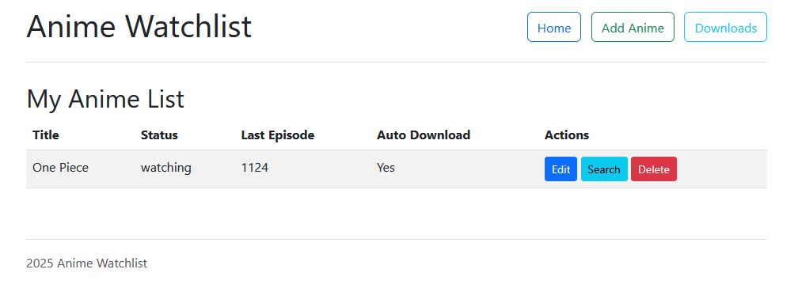
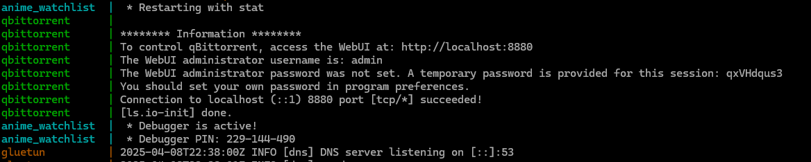
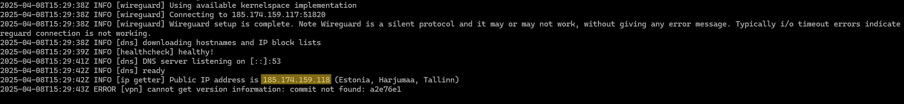
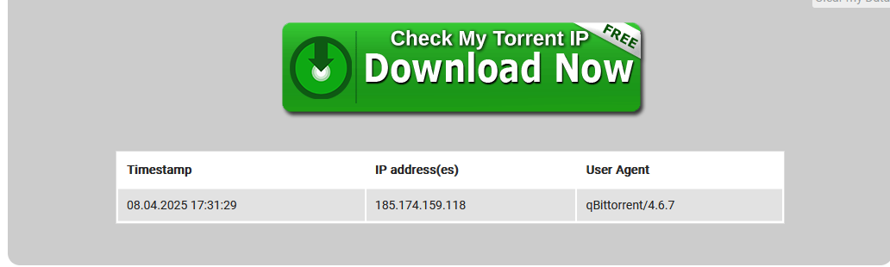

# 🎬 Anime Watchlist Downloader (VPN+Killswitch)
Auto-download new anime episodes from [Nyaa.si](https://nyaa.si) using search queries and track what you're watching.

🚀 Built with:
- 🐍 Python + Flask
- 🎞️ Torrent support via qBittorrent Web API
- 🧠 Episode detection via BeautifulSoup scraping
- 💾 Local SQLite database
- 🧰 Auto-scheduled background tasks

---

## 📸 Preview



---

## 🔧 Setup Instructions

- Clone or download the repo
- Rename .env.example to .env 
    - Add your private key to .env(Log into your Surfshark account, navigate to "VPN" > "Manual Setup" > "Router" > "WireGuard", select "I don't have a key pair", generate a new key pair, and then copy and securely store the private key, as it is only displayed once)
    - Change QB_PASSWORD !For the first time you'll get a temporary password which you need to change via WebUI! This one is needed later for tansfering torrents
        - Optional other Settings like SERVER_COUNTRIES,WIREGUARD_ADDRESSES,VPN_SERVICE_PROVIDER
- ```sudo docker compose -f docker-compose.yml up```
- 
- Login using the temporary password
- Change password to the one set in .env (Cockwheel -> WebUI)
- ```sudo ./container-restart.sh``` Wireguard might not work from beginning and needs a restart

You can use [TorGuard](https://torguard.net/checkmytorrentipaddress.php) to check your IP. 




## Search-Query

> Customize queries for better results. Specify Realease-Groups like [ASW],[Erai-raws],.. or video resolution like 1080p
> For example: [Erai-raws] Saikyou no Ousama, Nidome no Jinsei wa Nani o Suru? 1080p 


## Known Issues

- WireGuard VPN no connection (Workaround restart-script)
- Invalid input at Episode counter.

## Future Task (far far away) 

- Covers
- RLS-DB feed instead of schedule
- Streaming-Player
- Download-Layout improvements

### Surfshark

If you decide to use Surfshark, I would appreciate it if you would use my ref-link:

https://surfshark.club/friend/PQMEpuQS

On top of any currently running deal, your friend will get:

    1 free month — if they purchase a 1-month plan;
    3 free months — if they purchase a 12-month plan;
    3 free months — if they purchase a 24-month plan.

> You can deactivate the automated renew a few month before ending and get a discount


### Donations

https://buymeacoffee.com/mux1337

http://patreon.com/muX1337

### Special thanks

- Family and Friends <3
- [Quentin McGaw](https://github.com/qdm12) for gluetun
- [Linuxserver](https://www.linuxserver.io/) for qBittorent Docker image
- [Claude](https://claude.ai/) for doing the coding
- All release Groups

### Contact

[Shit-Storm-Page](https://x.com/MuxLeet)
